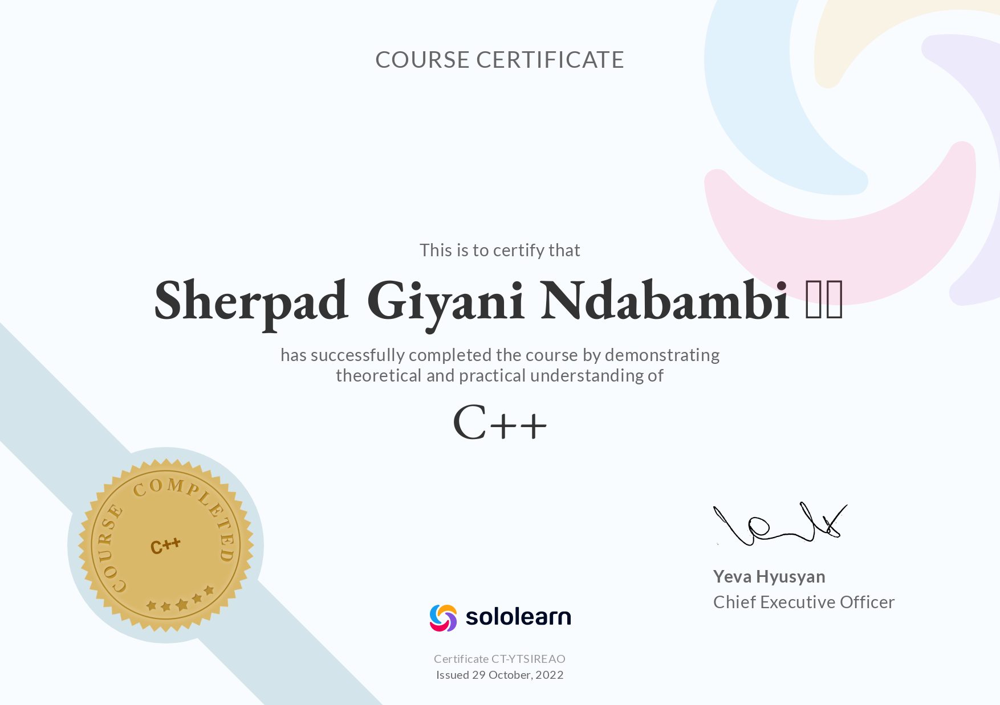
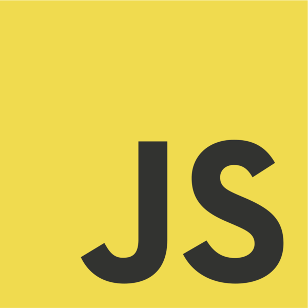
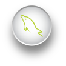
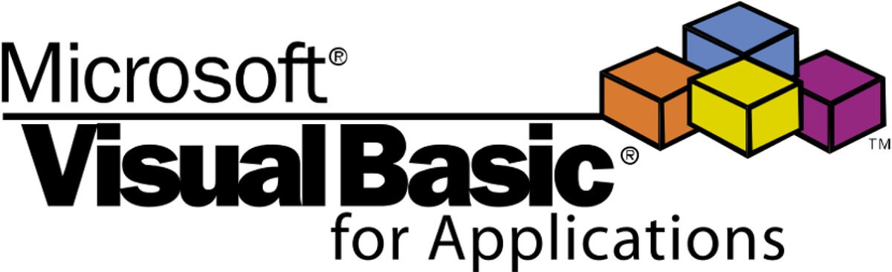
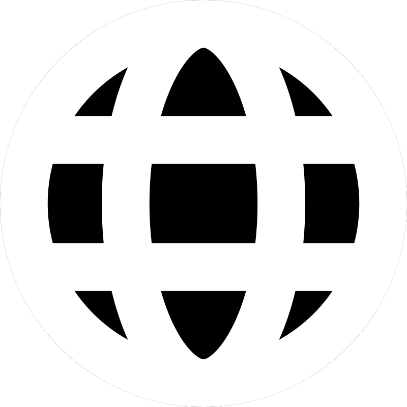
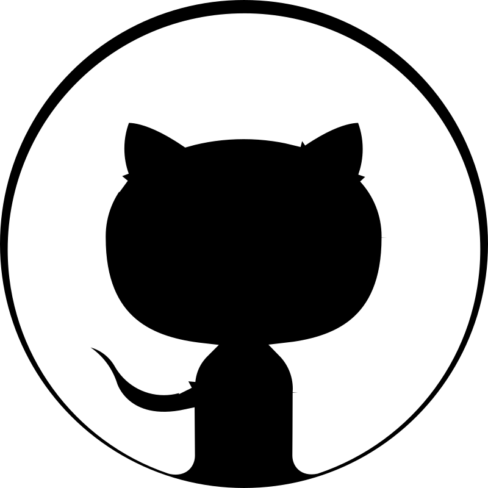

# Sherpad Ndabambi

Hello there 👋🏾, I'm Sherpad.

## Table of Contents

Contents

- [About Me](#about-me-👨🏾‍💻)
- [Certificates](#certificates-🏅)
- [Frameworks](#frameworks-🛠️)
- [GitHub Contribution Graph](#github-contribution-graph-📈)
- [Languages](#languages-📝)
  - [Professional](#professional-👨🏾‍🏭)
  - [Academic](#academic-🏫)
  - [Hobby](#hobby-🧘🏾‍♂️)
  - [Most Used Languages](#most-used-languages-🌟)
- [Links](#links-🔗)
- [Rankings](#rankings-🏆)
- [Notes](#notes)
- [Attributions](#attributions)

## About Me 👨🏾‍💻

🎓 I'm a BSc in Computing student at the University of South Africa.

💻 I'm currently learning web development through [freeCodeCamp](https://www.freecodecamp.org/).

## Certificates 🏅

Here are some of my certificates:

[Responsive Web Design (freeCodeCamp)](https://www.freecodecamp.org/certification/Sherpad/responsive-web-design)

[Game Development with JS (Sololearn)](https://www.sololearn.com/certificates/CT-MMIVGCTR)

[C++ (Sololearn)](https://www.sololearn.com/certificates/CT-YTSIREAO)

## Frameworks 🛠️

I'm familiar with the following frameworks:

[](https://flutter.dev/)

## GitHub Contribution Graph 📈

## Languages 📝

### Professional 👨🏾‍🏭

I've programmed in the following languages professionally:

[](https://html.spec.whatwg.org/)
[](https://www.w3.org/TR/CSS/#css)
[](http://www.ecma-international.org/publications-and-standards/standards/ecma-262/)

### Academic 🏫

I've completed courses in the following languages:

[](https://isocpp.org/)
[](https://learn.microsoft.com/en-us/dotnet/csharp/)
[](https://dart.dev/)
[](https://www.php.net/)
[](https://www.python.org/)
[](https://www.iso.org/standard/63555.html)

### Hobby 🧘🏾‍♂️

I've written code in these languages as a hobby:

[](https://www.gnu.org/software/bash/)
[](https://script.google.com/)
[](http://fishshell.com/)
[](https://daringfireball.net/projects/markdown/)
[](https://en.wikipedia.org/wiki/Visual_Basic_for_Applications)

### Most Used Languages 🌟

## Links 🔗

Connect with me.

## Rankings 🏆

[CodinGame](https://www.codingame.com/) - 48,623rd (top 8% 🌍, top 9% 🇿🇼)\*

[Clash of Code!](https://www.codingame.com/multiplayer/clashofcode) - 282,303rd / 496,374 (top 57% ⬆️)

## Notes

\* CodinGame and Clash of Code! rankings last updated on the 29th November, 2022

## Attributions

[C# logo](https://upload.wikimedia.org/wikipedia/commons/0/0d/C_Sharp_wordmark.svg) by [Jason Groce](https://github.com/jasongroce) from [GitHub](https://github.com/dotnet/docs/blob/cb475ed45f881e9462e34764480d3b0ebce85e91/docs/images/hub/csharp.svg)

[C++ logo](https://upload.wikimedia.org/wikipedia/commons/1/18/ISO_C%2B%2B_Logo.svg) by Jeremy Kratz from [GitHub](https://github.com/isocpp/logos)

[Codechef icon](https://icons8.com/icon/O4SEeX66BY8o/codechef) by [Icons8](https://icons8.com/)

[Codepip icon](https://pbs.twimg.com/profile_images/1323425723969929218/bT8Uxv_i_400x400.jpg) by [Codepip](https://codepip.com/)

[CodeWars icon](https://docs.codewars.com/logo.svg) by [CodeWars](https://www.codewars.com/)

[CodinGame icon](https://avatars.githubusercontent.com/u/6946974?s=280&v=4) by [CodinGame](https://www.codingame.com/)

[CSS3 logo](https://upload.wikimedia.org/wikipedia/commons/6/62/CSS3_logo.svg) by [daPhyre](https://www.deviantart.com/daphyre/)

[Dart logo icon](https://upload.wikimedia.org/wikipedia/commons/a/a2/Dart_programming_language_logo_icon.svg) by https://dart.dev/

[Exercism logo](https://dg8krxphbh767.cloudfront.net/meta/favicon-32x32.png) by [Exercism](https://exercism.org/)

[Facebook icon](https://cdn-icons-png.flaticon.com/512/5968/5968764.png) made by [Freepik](https://www.freepik.com) from [Flaticon](https://www.flaticon.com/)

[Fish logo](https://upload.wikimedia.org/wikipedia/commons/d/d8/Fish-shell-logo-ascii.svg) by ComFoxx from [Wikimedia Commons](https://commons.wikimedia.org/wiki/Main_Page)

[Flutter icon](https://en.wikipedia.org/wiki/File:Google-flutter-logo.svg) by [Google](https://about.google/)

[GitHub icon](https://cdn-icons-png.flaticon.com/128/733/733609.png) made by [Pixel perfect](https://www.flaticon.com/authors/pixel-perfect) from [Flaticon](https://www.flaticon.com/)

[Google Apps Script logo](https://upload.wikimedia.org/wikipedia/commons/2/2f/Google_Apps_Script.svg) by [Google](http://google.com/)

[Google Developers Logo](https://upload.wikimedia.org/wikipedia/commons/4/45/GDevs.png) by [Google](http://google.com/) from [Google Developers](https://developers.google.com/)

[GNU Bash logo](https://upload.wikimedia.org/wikipedia/commons/8/82/Gnu-bash-logo.svg) by [Free Software Foundation](https://www.fsf.org/)

[HTML5 badge](https://upload.wikimedia.org/wikipedia/commons/6/61/HTML5_logo_and_wordmark.svg) by [W3C](https://www.w3.org/html/logo/index.html)

[Javascript logo](https://upload.wikimedia.org/wikipedia/commons/6/6a/JavaScript-logo.png) by [Ramaksoud2000](https://commons.wikimedia.org/wiki/User:Ramaksoud2000) via Chris Williams

[LinkedIn icon](https://cdn-icons-png.flaticon.com/512/3536/3536505.png) by [riajulislam](https://www.flaticon.com/authors/riajulislam) from [Flaticon](https://www.flaticon.com)

[Markdown mark](https://upload.wikimedia.org/wikipedia/commons/4/48/Markdown-mark.svg) by Dustin Curtis from [GitHub](https://github.com/dcurtis/markdown-mark/tree/master/svg)

[PHP logo](https://upload.wikimedia.org/wikipedia/commons/2/27/PHP-logo.svg) by Colin Viebrock from http://php.net/logos

[Python logo](https://upload.wikimedia.org/wikipedia/commons/c/c3/Python-logo-notext.svg) by http://www.python.org

[SQL logo](https://upload.wikimedia.org/wikipedia/commons/9/94/Sql-icon.svg) by [Sokote zaman](https://commons.wikimedia.org/wiki/User:Sokote_zaman)

[TopCoder icon](https://www.topcoder.com/wp-content/uploads/2020/05/cropped-TC-Icon-32x32.png) by [TopCoder](https://www.topcoder.com/)

[Twitter icon](https://cdn-icons-png.flaticon.com/512/733/733579.png) made by [Pixel perfect](https://www.flaticon.com/authors/pixel-perfect) from [Flaticon](www.flaticon.com)

[VBA logo](https://www.tachytelic.net/wp-content/uploads/VBA_LOGO_Featured.png) from [Tachytelic.net](https://www.tachytelic.net/)
