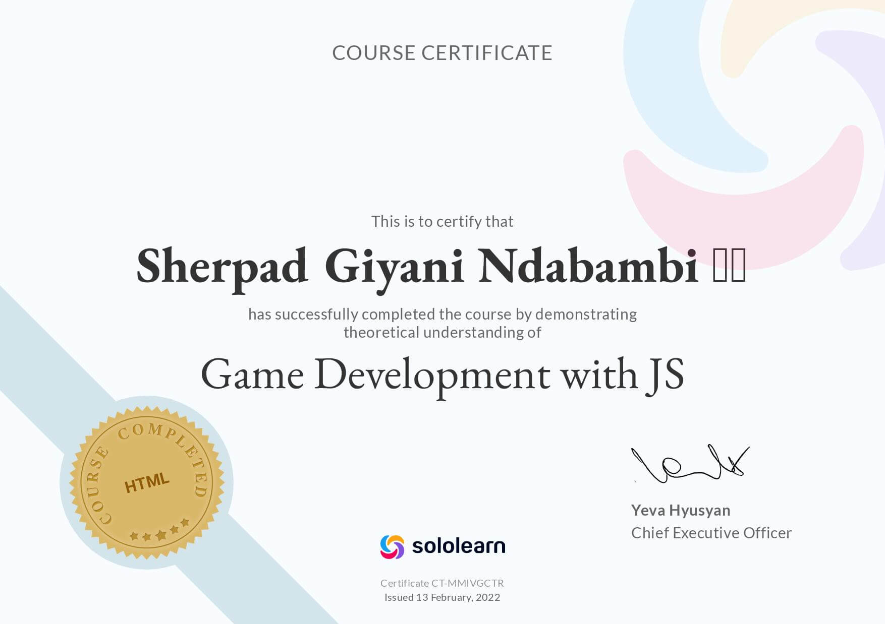

# Sherpad Ndabambi #

Hello there 👋🏾, I'm Sherpad.

## Table of Contents ##

Contents

- [About Me](#about-me-👨🏾‍💻)
- [Certificates](#certificates-🏅)
- [Frameworks](#frameworks-🛠️)
- [GitHub Contribution Graph](#github-contribution-graph-📈)
- [Languages](#languages-📝)
    - [Professional](#professional-👨🏾‍🏭)
    - [Academic](#academic-🏫)
    - [Hobby](#hobby-🧘🏾‍♂️)
    - [Most Used Languages](#most-used-languages-🌟)
- [Links](#links-🔗)
- [Rankings](#rankings-🏆)
- [Attributions](#attributions)
- [Notes](#notes)

## About Me 👨🏾‍💻 ##

🎓 I'm a BSc in Computing student at the University of South Africa.

💻 I'm currently learning web development through [freeCodeCamp](https://www.freecodecamp.org/).

## Certificates 🏅 ##

[Game Development with JS (Sololearn)](https://www.sololearn.com/certificates/CT-MMIVGCTR)

[C++ (Sololearn)](https://www.sololearn.com/certificates/CT-YTSIREAO)

## Frameworks 🛠️ ##

## GitHub Contribution Graph 📈 ##

## Languages 📝 ##

### Professional 👨🏾‍🏭 ###

I've programmed in the following languages professionally:

1. HTML
1. CSS
1. JavaScript

### Academic 🏫 ###

I've completed formal courses in the following languages:

1. C++
1. C#
1. Dart
1. PHP
1. Python
1. SQL

### Hobby 🧘🏾‍♂️ ###

I've written code in these languages as a hobby:

1. Bash
1. Googlescript
1. Fish
1. Markdown
1. Shell
1. VBA

### Most Used Languages 🌟 ###

## Links 🔗 ##

## Rankings 🏆 ##

[CodinGame](https://www.codingame.com/) - 48,623rd (top 8% 🌍, top 9% 🇿🇼)*

[Clash of Code!](https://www.codingame.com/multiplayer/clashofcode) - 282,303rd / 496,374 (top 57% ⬆️)

## Attributions ##

[Codechef icon](https://icons8.com/icon/O4SEeX66BY8o/codechef) by [Icons8](https://icons8.com/)

[Codepip icon](https://pbs.twimg.com/profile_images/1323425723969929218/bT8Uxv_i_400x400.jpg) by [Codepip](https://codepip.com/)

[CodeWars icon](https://docs.codewars.com/logo.svg) by [CodeWars](https://www.codewars.com/)

[CodinGame icon](https://avatars.githubusercontent.com/u/6946974?s=280&v=4) by [CodinGame](https://www.codingame.com/)

[Exercism logo](https://dg8krxphbh767.cloudfront.net/meta/favicon-32x32.png) by [Exercism](https://exercism.org/)

[Facebook icon](https://cdn-icons-png.flaticon.com/512/5968/5968764.png) made by [Freepik](https://www.freepik.com) from [Flaticon](https://www.flaticon.com/)

[Flutter icon](https://en.wikipedia.org/wiki/File:Google-flutter-logo.svg) belongs to [Google](https://about.google/)

[GitHub icon](https://cdn-icons-png.flaticon.com/128/733/733609.png) made by [Pixel perfect](https://www.flaticon.com/authors/pixel-perfect) from [Flaticon](https://www.flaticon.com/)

[Google Developers Logo](https://upload.wikimedia.org/wikipedia/commons/4/45/GDevs.png) by [Google](http://google.com/) from [Google Developers](https://developers.google.com/)

[LinkedIn icon](https://cdn-icons-png.flaticon.com/512/3536/3536505.png) by [riajulislam](https://www.flaticon.com/authors/riajulislam) from [Flaticon](https://www.flaticon.com)

[TopCoder icon](https://www.topcoder.com/wp-content/uploads/2020/05/cropped-TC-Icon-32x32.png) by [TopCoder](https://www.topcoder.com/)

[Twitter icon](https://cdn-icons-png.flaticon.com/512/733/733579.png) made by [Pixel perfect](https://www.flaticon.com/authors/pixel-perfect) from [Flaticon](www.flaticon.com)

## Notes ##

\* CodinGame ranking last updated on the 29th November, 2022